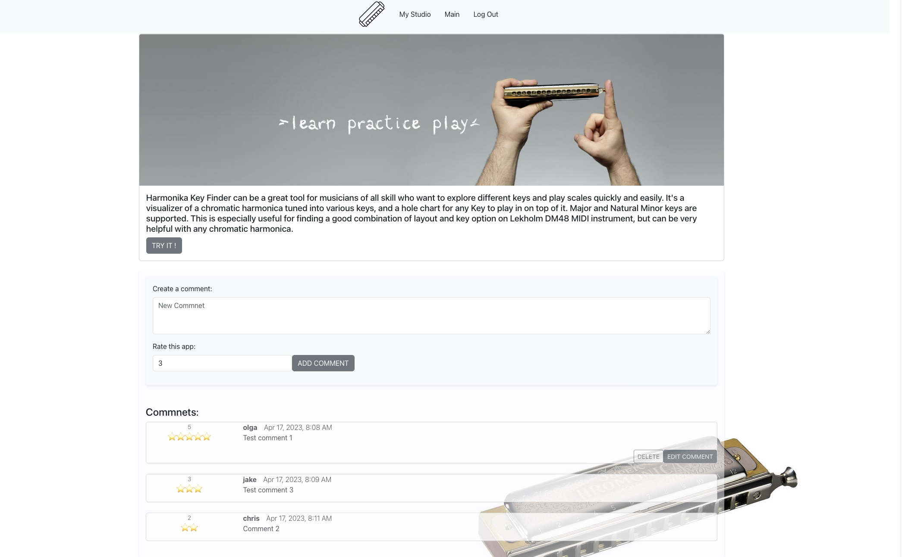
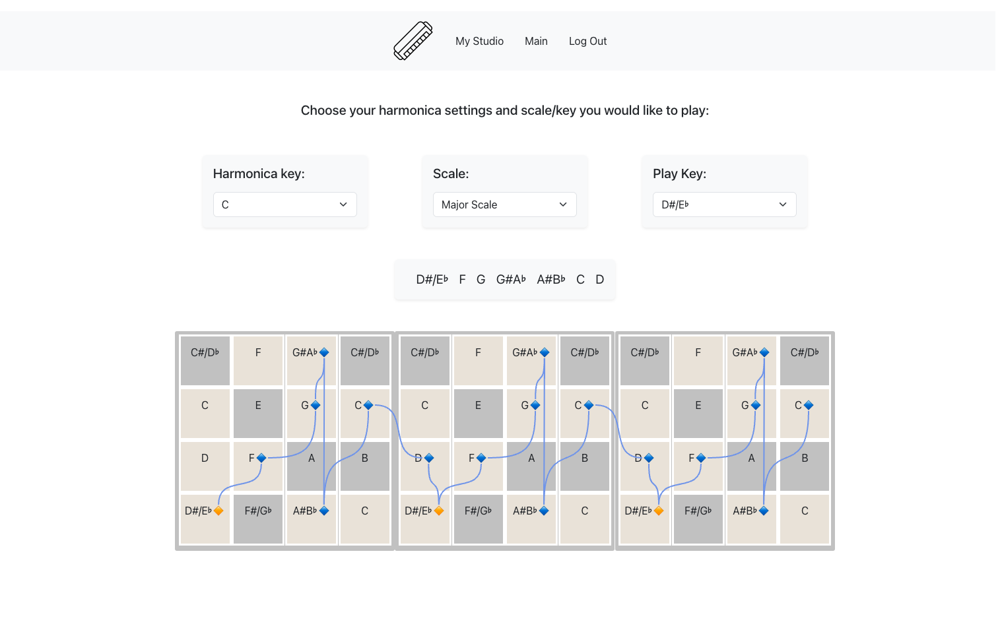

# Harmonica Key Finder

Harmonika Key Finder can be a great tool for musicians of all skill who want to explore different keys and play scales quickly and easily. It's a visualizer of a chromatic harmonica tuned into various keys, and a hole chart for any Key to play in on top of it. Major and Natural Minor keys are supported. This is especially useful for finding a good combination of layout and key option on Lekholm DM48 MIDI instrument, but can be very helpful with any chromatic harmonica.

### Screenshots

## 👀 Take a look at FlyByExpress [HERE](https://harmonica-key-finder.herokuapp.com/)

## Technologies Used

## Next spets:

Attach different library that will ensure reliable arrow generate. Add more scales. Implement possibility to save user's setups into DB.
Mark blow, draw, slider.